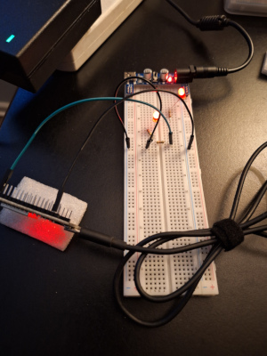
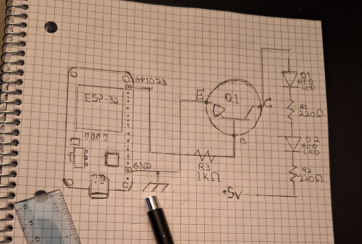

# Blinky Thing 🚀

## Summary:

This is a project about getting a pro-level embedded dev environment running, and getting back into C/C++ programming. The main goal was to skip all the Docker noise, and hand-roll the ESP-IDF toolchain directly on **Debian 13 (Trixie)** 🐧. By running everything natively, I get a much more customizable workflow and a better understanding of how the tooling for embedded systems development actually works.

The circuit uses an **ESP32** to toggle an **NPN transistor**(type PN2222), which handles the heavy lifting of powering a series of LEDs from a 5V rail. This keeps the load off the MCU pins and makes the project a bit more interesting to build and document.

It serves as a foundational "refresh" for:

* **Embedded Systems Development** on **Linux** 🐧
* **ESP-IDF** and the `idf.py` workflow
* **C Programming** (C17)
* **VS Code & Intellisense** (You can steal my `c_cpp_properties.json`, just swap `/home/jdevs/` for your own home directory)
* **Circuit Diagramming**

## Component List:

* **ESP32 DevKit V1 x1** — MCU1
* **PN2222 NPN Transistor x1** — Q1
* **Red LEDs x2** — D1, D2
* **Resistors:**
   * **220Ω x2** — R1, R2
   * **1kΩ x1** — R3
* **Power:** 5V/3V Breadboard module + 25W DC Adapter ⚡

## Development Environment:

* **OS:** Debian 13 (Trixie) 🐧
* **Toolchain:** Native ESP-IDF
* **Workflow:** `idf.py` CLI for `set-target` and `menuconfig` (configured for 4MB flash)
* **Editor:** VS Code + C/C++ Extension Pack + ESP-IDF + Tabout 💻

## Logic & Circuit:

* **Code:** Written in C using the GPIO driver and FreeRTOS task scheduler.
* **Error Handling:**  Uses `esp_err.h` - to catch errors and throw helpful messages like `ESP_LOGE(TAG, "Failed to blink good.\n");`
* **Documentation:** Banner-style comments because we do some things the graybeard way
* **Diagnostics:** `esp_log.h` - used for serial state monitoring and error reporting.
* **Control:** `driver/gpio.h` - GPIO 23 toggles the base of the PN2222 every 800ms.
* **Switching:** `PN2222` transistor handles the 5V rail to drive the LEDs in series, keeping the load off the MCU.